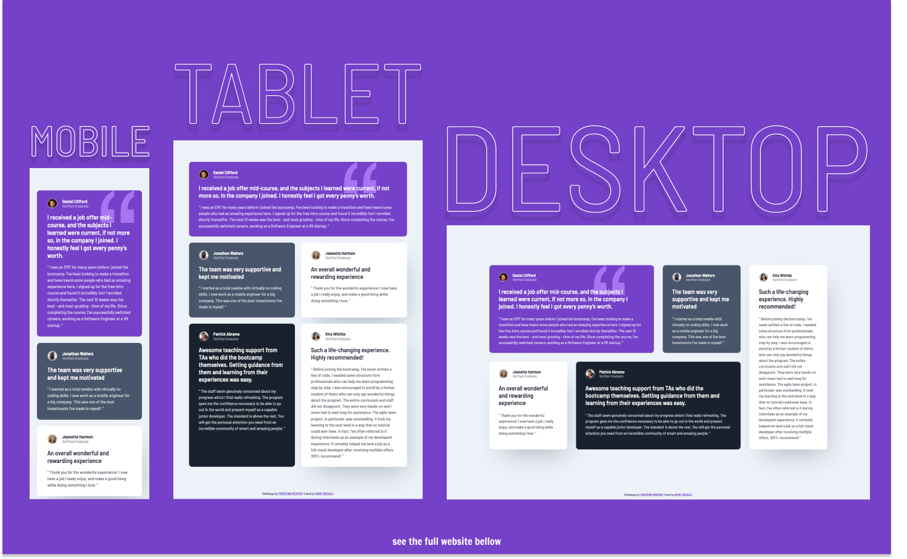

# Frontend Mentor - Testimonials Grid Section Solution

This is a solution to the [Testimonials Grid Section Challenge on Frontend Mentor](https://www.frontendmentor.io/challenges/testimonials-grid-section-Nnw6J7Un7).

## Table of contents

- [Overview](#overview)
  - [The challenge](#the-challenge)
  - [Screenshot](#screenshot)
  - [Links](#links)
- [My process](#my-process)
  - [Built with](#built-with)
  - [What I learned](#what-i-learned)
  - [Useful resources](#useful-resources)
- [Author](#author)

## Overview

### The challenge

Users should be able to:

- View the optimal layout for the site depending on their device's screen size

### Screenshot

### Links

- Live Site URL: [https://kens-visuals.github.io/testimonials-grid-section/](https://kens-visuals.github.io/testimonials-grid-section/)
- Solution URL: [https://www.frontendmentor.io/solutions/testimonials-grid-section-with-scss-bem-and-css-grid-dr2f83Qua](https://www.frontendmentor.io/solutions/testimonials-grid-section-with-scss-bem-and-css-grid-dr2f83Qua)

## My process

### Built with

- Semantic HTML5 markup
- SCSS custom properties
- CSS Flexbox
- CSS Grid
- Mobile-first workflow

### What I learned

This was the fastest project that I've done on Frontend Mentor. It took me literally 2 hours to finish the whole thing with animations, and responsiveness. However, I understand that this is the result of daily practice and nothing makes me happier than seeing these results.

## Author

- Frontend Mentor - [@kens-visuals](https://www.frontendmentor.io/profile/kens-visuals)
- Codewars - [@kens_visuals](https://www.codewars.com/users/kens_visuals)
- CodePen - [@kens-visuals](https://codepen.io/kens-visuals)
